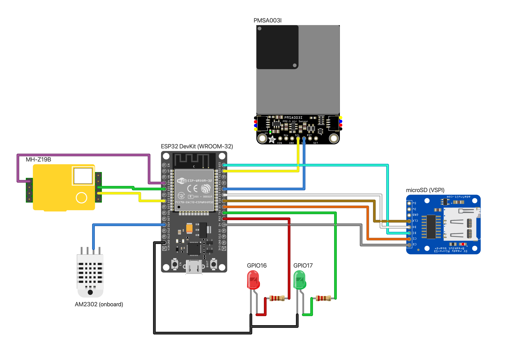
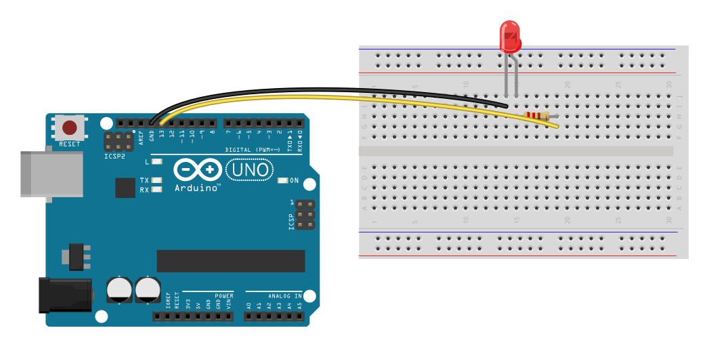
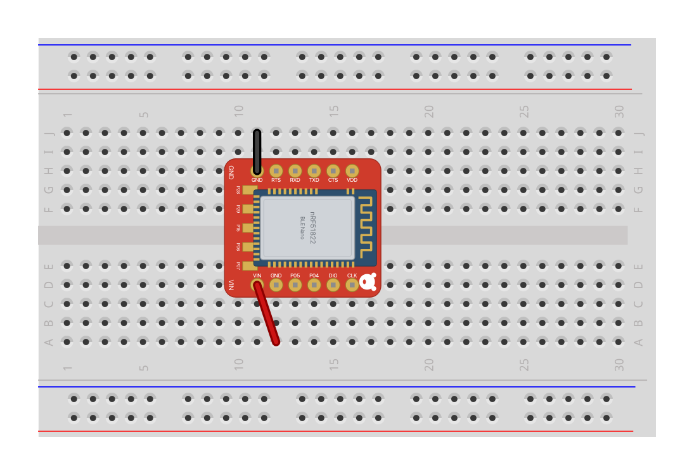
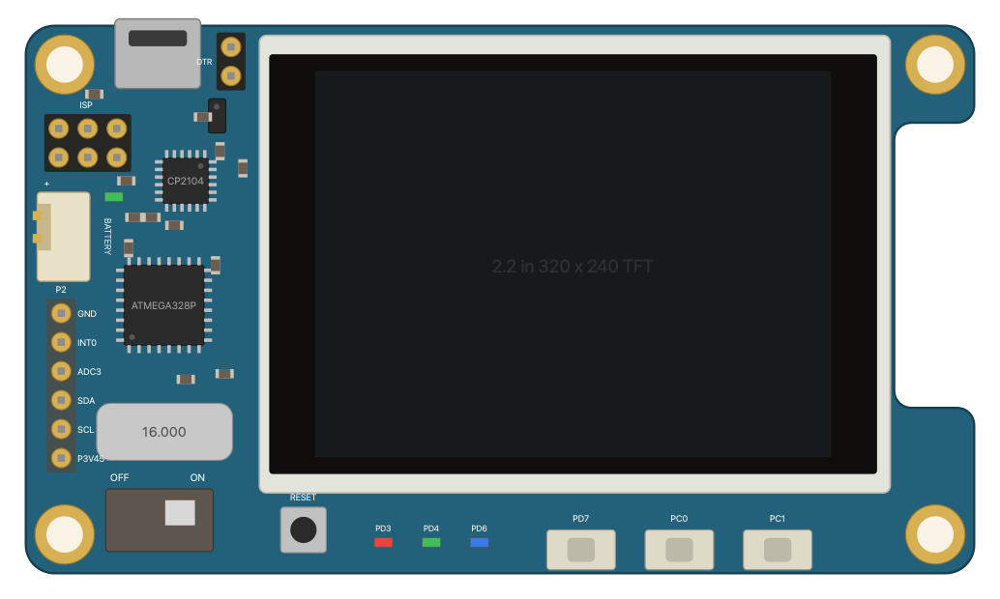

# fritzing-render

Renders Fritzing breadboard diagrams to SVG and PNG without the Fritzing app,
using Fritzing's own SVG code and its parts libraries: sketches saved by the
Fritzing app (`.fzz`), or diagrams described in JSON. Comes with a CLI and an
MCP server, so an agent can search parts, read their pins, render a diagram
and look at the image. A [Docker image](#docker) has it all, parts included.



More in [examples/](examples): an [ODROID-SHOW2 on a LiPo with a BLE Nano relay](examples/odroid-show2.png), a [FeatherS2 air station](examples/feathers2-air.png) with three Adafruit sensors and a BLE Nano bridge, and a [smoke test](examples/smoke.png). Their sketches are the `.json` files beside them.

## Docker

```sh
docker pull ghcr.io/leonfedotov/fritzing-render
```

For linux/amd64 and linux/arm64, with Fritzing's core parts (obsolete ones
too, for old sketches), Adafruit's and SparkFun's libraries and the
community parts listed under [Licence](#licence).
With no arguments it runs the MCP server on stdio; `render`, `search` and
`part` run the CLI, in `/work`:

```sh
docker run --rm -v "$PWD:/work" ghcr.io/leonfedotov/fritzing-render render sketch.fzz -o sketch.svg --png sketch.png
docker run --rm ghcr.io/leonfedotov/fritzing-render search arduino nano
```

As an MCP server for Claude Code (`.mcp.json`), with the project folder
mounted at its own path so the tools can take the paths you use:

```json
{
  "mcpServers": {
    "fritzing-render": {
      "type": "stdio",
      "command": "docker",
      "args": ["run", "-i", "--rm", "-v", "${PWD}:${PWD}", "-w", "${PWD}", "ghcr.io/leonfedotov/fritzing-render"]
    }
  }
}
```

or `claude mcp add fritzing-render -- docker run -i --rm -v "$PWD:$PWD" -w "$PWD" ghcr.io/leonfedotov/fritzing-render`.
The container runs as root; on Linux, add `--user "$(id -u):$(id -g)"` to
keep files it saves yours.

### Example

[`examples/blink.fzz`](examples/blink.fzz) is the classic blink circuit: an
Arduino Uno driving a red LED through a 220 Ω resistor on a half
breadboard. An `.fzz` is a zip holding the sketch's `.fz` XML (plus any
custom parts); this one holds just [`blink.fz`](examples/blink.fz), small
enough to read whole:

```xml
<?xml version="1.0" encoding="UTF-8"?>
<module fritzingVersion="1.0.8">
  <instances>
    <instance moduleIdRef="arduino_Uno_Rev3(fix)" modelIndex="1" path="arduino_Uno_Rev3(fix).fzp">
      <title>Arduino</title>
      <views><breadboardView layer="breadboardbreadboard"><geometry z="1.5" x="0" y="60"/></breadboardView></views>
    </instance>
    <instance moduleIdRef="0152b316-ca6e-11ee-a6fa-8be78db221f8BreadboardModuleID" modelIndex="2" path="Half_breadboard_v2.fzp">
      <title>Breadboard</title>
      <views><breadboardView layer="breadboardbreadboard"><geometry z="1.6" x="300" y="0"/></breadboardView></views>
    </instance>
    <instance moduleIdRef="LED-genedb611bf8177f41ac9c325217070f0c62ColorLEDModuleID" modelIndex="3" path="LED-generic-5mm_6852162_005.fzp">
      <property name="color" value="Red (633nm)"/>
      <title>LED1</title>
      <views><breadboardView layer="breadboard"><geometry z="2.5" x="424.99" y="-22.28"/></breadboardView></views>
    </instance>
    <instance moduleIdRef="ResistorModuleID" modelIndex="4" path="resistor.fzp">
      <property name="resistance" value="220Ω"/>
      <title>R1</title>
      <views><breadboardView layer="breadboard"><geometry z="2.6" x="438.34" y="58.46"/></breadboardView></views>
    </instance>
    <instance moduleIdRef="WireModuleID" modelIndex="5" path="wire.fzp">
      <title>D13</title>
      <views>
        <breadboardView layer="breadboardWire">
          <geometry z="3.5" x="125.06" y="69" x1="0" y1="0" x2="350.59" y2="3" wireFlags="64"/>
          <wireExtras mils="22.2222" color="#ffe24d" opacity="1" banded="0">
            <bezier><cp0 x="40" y="-45"/><cp1 x="300" y="-15"/></bezier>
          </wireExtras>
        </breadboardView>
      </views>
    </instance>
    <instance moduleIdRef="WireModuleID" modelIndex="6" path="wire.fzp">
      <title>GND</title>
      <views>
        <breadboardView layer="breadboardWire">
          <geometry z="3.5" x="116.06" y="69" x1="0" y1="0" x2="314.59" y2="-15" wireFlags="64"/>
          <wireExtras mils="22.2222" color="#404040" opacity="1" banded="0">
            <bezier><cp0 x="30" y="-45"/><cp1 x="260" y="-30"/></bezier>
          </wireExtras>
        </breadboardView>
      </views>
    </instance>
  </instances>
</module>
```

Parts are named by their Fritzing module id, placed in scene units (90 per
inch), and wires run between end points, curved by Bézier control points.
Render it with nothing installed but Docker:

```sh
cd examples
docker run --rm -v "$PWD:/work" ghcr.io/leonfedotov/fritzing-render render blink.fzz --png blink.png
```

`blink.png`:



## How it works

Fritzing exports a view in `SketchWidget::renderToSVG`: each part's SVG for
that view is split out of its file and scaled to the export DPI, placed, and
the wires are appended. This project compiles the self-contained part of that
pipeline straight from a [fritzing-app](https://github.com/fritzing/fritzing-app)
checkout, 14 source files:

| Fritzing code | Used for |
|---|---|
| `SvgFileSplitter` | pulling a part's breadboard layer out of its SVG and normalizing it to 1000 dpi |
| `FSvgRenderer`, `SvgIdLayer` | connector geometry: pin rectangles, terminal points, bendable legs |
| `TextUtils`, `GraphicsUtils` | SVG cleanup (`fixMuch`), the document header, wire lines |
| the SVG path parser, `ViewLayer`, helpers | what those include |

The rest of Fritzing's rendering path lives in classes that pull in the whole
application (`ModelPartShared`, `Wire`, `ConnectorItem`, `SketchWidget`), so
those pieces are reimplemented in `src/`, following the originals:

- `fzp.cpp`: reading `.fzp` part files
- `partlib.cpp`: finding parts and their SVGs in the libraries
- `render.cpp`: the compose loop, wires (`Wire::makeWireSVG`: a 2-unit line over a 4-unit shadow, colors from Fritzing's `ratsnestcolors.xml`) and unbent legs (`ConnectorItem::makeLegSvg`)

Fritzing sketches (`.fzz`, a zip of the `.fz` XML and any parts it
bundles) are read in `fzz.cpp`: each breadboard-view part with its saved
transform, LED color and bent legs; each breadboard wire, curves included,
leaving out PCB and schematic traces and wires to items the view hides, as
Fritzing does. Parts are found by module id, in the bundled copies first,
then the libraries, obsolete parts included. Generic pin headers, which
Fritzing generates rather than ships, are made from its templates
(`generated.cpp`). Notes, and parts no library has (DIP and mystery chips,
stripboards), are left out with a warning.

Two deliberate differences from Fritzing's export:

- A part whose breadboard view has a single layer is drawn whole, as the
  Fritzing app loads it (`ItemBase::setUpImage`), and so is one whose drawing
  has no element for its layer; Fritzing's own SVG export splits the layer
  out regardless, dropping whatever lies outside it (common in community
  parts) or the whole part.
- Unbent legs are drawn straight; there is no way to describe bent legs yet.

Only the breadboard view is rendered so far.

## Build

Clone with `--recurse-submodules`: Adafruit's and SparkFun's Fritzing
libraries are submodules under `libraries/` (`fetch-vendor.sh` initializes
them if you didn't). Needs Qt 6 (6.8 and 6.11 tested) with its private headers (for the zip
reader), Boost headers, CMake, and a fritzing-app checkout next to this repo
(or `-DFRITZING_APP=...`). Or build the image: `docker build -t fritzing-render .`

```sh
brew install qt boost cmake
git clone https://github.com/fritzing/fritzing-app ../fritzing-app
scripts/fetch-vendor.sh                 # svgpp, fritzing-parts, unpacked Adafruit and SparkFun parts, community parts
cmake -S . -B build -DCMAKE_PREFIX_PATH=/opt/homebrew/opt/qt
cmake --build build -j
(cd build && ctest)
```

## CLI

```sh
build/fritzing-render search arduino nano                   # titles and the "part" ref to use
build/fritzing-render part "core/Arduino Nano3(fix).fzp"    # size and connectors
build/fritzing-render render examples/smoke.json -o out.svg --png out.png --ppi 200
build/fritzing-render render ../fritzing-app/sketches/core/Button.fzz --png button.png
```

`render` takes a JSON sketch, an `.fzz` or an `.fz`, told apart by their
contents (`-` reads stdin).

Add `--json` to `search` and `part` for machine-readable output. Parts are
looked up in `FRITZING_PARTS` (colon-separated library roots) if set, else in
`vendor/`.

## Sketch format

```json
{
  "parts": [
    { "id": "mcu", "part": "core/Arduino Nano3(fix).fzp", "x": 0, "y": 0, "label": "Arduino Nano" },
    { "id": "r1", "part": "core/resistor.fzp", "x": 120, "y": 40, "rotate": 90 },
    { "id": "led", "part": "core/LED-generic-5mm_6852162_005.fzp", "x": 200, "y": 0, "color": "green" },
    { "id": "relay", "generic": { "title": "BLE Nano", "pins": ["TX", "GND"] }, "x": 260, "y": 0 }
  ],
  "wires": [
    { "from": "mcu.D2", "to": "r1.connector0", "color": "green", "via": [[90, 49.5]] }
  ],
  "margin": 18
}
```

- Coordinates are Fritzing scene units: 90 per inch (header pins are 9 apart), y down.
- `x`/`y` place a part's top-left corner; `rotate` (0, 90, 180, 270, clockwise) turns it about its centre.
- `part` is a ref from `search`, an `.fzp` path, a moduleId or an exact title.
- `generic` instead of `part` draws a labelled block with 0.1 in header pins along its bottom, for parts no library has.
- `label` draws text above the part (`labelBelow: true` puts it under).
- `color` recolors a part's `color_*` elements, as Fritzing does for LEDs: a Fritzing LED color (`"Green (555nm)"`), a word (`green`: Fritzing's default shade) or `#rrggbb`.
- Wire ends are `<part id>.<connector name or id>`; `via` adds bend points.
- A wire's `color` is a Fritzing wire color (blue, red, black, yellow, green, grey, white, orange, ochre, cyan, brown, purple, pink) or `#rrggbb`.

## MCP server

`mcp/` wraps the CLI as an MCP server with four tools: `search_parts`,
`describe_part`, `render_diagram`, which renders a diagram given as parts
and wires, and `render_fritzing_sketch`, which renders a sketch file (`.fzz`,
`.fz` or JSON) by path. The two render tools return the PNG as an image, with
any warnings, and can save the SVG and PNG.

```sh
cd mcp && pnpm install
pnpm test && pnpm typecheck
```

Register it with Claude Code (or use the [Docker image](#docker)), e.g. in a project's `.mcp.json`:

```json
{
  "mcpServers": {
    "fritzing-render": {
      "type": "stdio",
      "command": "/path/to/fritzing-render/mcp/node_modules/.bin/tsx",
      "args": ["/path/to/fritzing-render/mcp/src/server.ts"]
    }
  }
}
```

`FRITZING_RENDER_BIN` overrides the CLI's location (default `build/fritzing-render`).

## Licence

GPL-3.0-or-later, as it compiles Fritzing's GPL sources. The parts libraries
are not part of this code (the Docker image does include them, with
Fritzing's fonts), and they and the part drawings in rendered images,
including the examples here, are under their own terms:

- [fritzing-parts](https://github.com/fritzing/fritzing-parts): CC BY-SA 3.0, fetched
- [adafruit/Fritzing-Library](https://github.com/adafruit/Fritzing-Library): CC BY-SA 3.0, submodule
- [sparkfun/Fritzing_Parts](https://github.com/sparkfun/Fritzing_Parts): CC BY-SA 4.0, submodule
- [TD-er/fritzing-parts](https://github.com/TD-er/fritzing-parts) (MH-Z19, NodeMCU, OLEDs): MIT, fetched
- [otherguy/FeatherS2-Fritzing](https://github.com/otherguy/FeatherS2-Fritzing) (Unexpected Maker FeatherS2): MIT, fetched
- DOIT ESP32 DevKit v1 (vanepp, Fritzing forum): no stated licence, fetched
- [`parts/`](parts): parts made here, CC BY-SA 4.0 (below)

## Parts made here

[`parts/`](parts) holds parts no library has, drawn from their makers'
published design files; it is searched with the other libraries. Each
folder is an unpacked `.fzpz`: zip its files to use the part in the Fritzing
app.

- **RedBear BLE Nano v1.5** (`RedBearBLENanoV1_5ModuleID`): pads, holes and
  outline from RedBear's v1.5 gerbers and DXF, pin names from its pinout and
  silkscreen ([redbear/nRF5x](https://github.com/redbear/nRF5x)). Two rows of
  six header pins 0.6 in apart, so it straddles a breadboard's gap, plus the
  five pads on the underside's bottom edge.



- **Hardkernel ODROID-SHOW2** (`HardkernelOdroidShow2ModuleID`): outline,
  holes, connectors and parts measured from Hardkernel's dimensioned board
  render, the LCD from the Tianma TM022HDH26 datasheet, pins from the rev 0.1
  schematic. Connectors: the I/O header P2 (P3V45, SCL, SDA, ADC3, INT0,
  GND), the ISP header, the DTR jumper and the battery connector.


