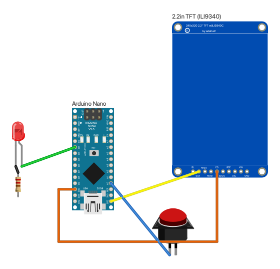

# fritzing-render

Renders Fritzing breadboard diagrams to SVG and PNG without the Fritzing app,
using Fritzing's own SVG code and its parts libraries. Comes with a CLI and an
MCP server, so an agent can search parts, read their pins, render a diagram
and look at the image.



## How it works

Fritzing exports a view in `SketchWidget::renderToSVG`: each part's SVG for
that view is split out of its file and scaled to the export DPI, placed, and
the wires are appended. This project compiles the self-contained part of that
pipeline straight from a [fritzing-app](https://github.com/fritzing/fritzing-app)
checkout, 14 source files:

| Fritzing code | Used for |
|---|---|
| `SvgFileSplitter` | pulling a part's breadboard layer out of its SVG and normalizing it to 1000 dpi |
| `FSvgRenderer`, `SvgIdLayer` | connector geometry: pin rectangles, terminal points, bendable legs |
| `TextUtils`, `GraphicsUtils` | SVG cleanup (`fixMuch`), the document header, wire lines |
| the SVG path parser, `ViewLayer`, helpers | what those include |

The rest of Fritzing's rendering path lives in classes that pull in the whole
application (`ModelPartShared`, `Wire`, `ConnectorItem`, `SketchWidget`), so
those pieces are reimplemented in `src/`, following the originals:

- `fzp.cpp`: reading `.fzp` part files
- `partlib.cpp`: finding parts and their SVGs in the libraries
- `render.cpp`: the compose loop, wires (`Wire::makeWireSVG`: a 2-unit line over a 4-unit shadow, colors from Fritzing's `ratsnestcolors.xml`) and unbent legs (`ConnectorItem::makeLegSvg`)

Only the breadboard view is rendered so far.

## Build

Needs Qt 6 (6.11 tested), Boost headers, CMake, and a fritzing-app checkout
next to this repo (or `-DFRITZING_APP=...`).

```sh
brew install qt boost cmake
git clone https://github.com/fritzing/fritzing-app ../fritzing-app
scripts/fetch-vendor.sh                 # svgpp, fritzing-parts, Adafruit's library (unpacked)
cmake -S . -B build -DCMAKE_PREFIX_PATH=/opt/homebrew/opt/qt
cmake --build build -j
(cd build && ctest)
```

## CLI

```sh
build/fritzing-render search arduino nano                   # titles and the "part" ref to use
build/fritzing-render part "core/Arduino Nano3(fix).fzp"    # size and connectors
build/fritzing-render render examples/smoke.json -o out.svg --png out.png --ppi 200
```

Add `--json` to `search` and `part` for machine-readable output. Parts are
looked up in `FRITZING_PARTS` (colon-separated library roots) if set, else in
`vendor/`.

## Sketch format

```json
{
  "parts": [
    { "id": "mcu", "part": "core/Arduino Nano3(fix).fzp", "x": 0, "y": 0, "label": "Arduino Nano" },
    { "id": "r1", "part": "core/resistor.fzp", "x": 120, "y": 40, "rotate": 90 }
  ],
  "wires": [
    { "from": "mcu.D2", "to": "r1.connector0", "color": "green", "via": [[90, 49.5]] }
  ],
  "margin": 18
}
```

- Coordinates are Fritzing scene units: 90 per inch (header pins are 9 apart), y down.
- `x`/`y` place a part's top-left corner; `rotate` (0, 90, 180, 270, clockwise) turns it about its centre.
- `part` is a ref from `search`, an `.fzp` path, a moduleId or an exact title.
- Wire ends are `<part id>.<connector name or id>`; `via` adds bend points.
- `color` is a Fritzing wire color (blue, red, black, yellow, green, grey, white, orange, ochre, cyan, brown, purple, pink) or `#rrggbb`.

## MCP server

`mcp/` wraps the CLI as an MCP server with three tools: `search_parts`,
`describe_part`, and `render_diagram`, which returns the PNG as an image (and
can save the SVG and PNG).

```sh
cd mcp && pnpm install
pnpm test && pnpm typecheck
```

Register it with Claude Code, e.g. in a project's `.mcp.json`:

```json
{
  "mcpServers": {
    "fritzing-render": {
      "type": "stdio",
      "command": "/path/to/fritzing-render/mcp/node_modules/.bin/tsx",
      "args": ["/path/to/fritzing-render/mcp/src/server.ts"]
    }
  }
}
```

`FRITZING_RENDER_BIN` overrides the CLI's location (default `build/fritzing-render`).

## Licence

GPL-3.0-or-later, as it compiles Fritzing's GPL sources. The parts libraries
are fetched, not included: Fritzing's are CC-BY-SA 3.0, Adafruit's are under
their own terms, and so are the part drawings in rendered images.
